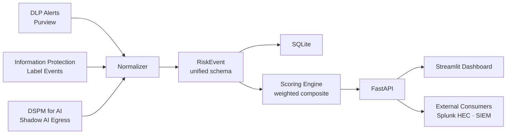

# 🛡️ ExposeBrief

**Reference architecture for normalizing DLP, Information Protection, and AI telemetry into a unified risk-scoring system.**

Most enterprises have three siloed data-security signals — DLP alerts, sensitivity-label events, and Shadow AI / DSPM-for-AI telemetry — and no way to answer the simple question: *who is actually risky right now?* ExposeBrief is a reference implementation that normalizes all three into one risk surface, applies a transparent weighted scoring model, and exposes it through a REST API and dashboard.

Built as FastAPI + Streamlit + SQLite. Seeded with realistic Shadow AI telemetry including foreign-AI-platform flagging. Demo-ready with one command.

---

## Architecture



The core architectural bet: **one unified event shape, many pluggable telemetry connectors.** Every upstream source is mapped into the `RiskEvent` schema (see [ARCHITECTURE.md](./ARCHITECTURE.md)) before anything else happens. Scoring, persistence, and API logic never see source-specific payloads.

---

## Quickstart

```bash
git clone https://github.com/<you>/exposebrief.git
cd exposebrief
docker compose up --build
```

Then open:
- Dashboard → http://localhost:8501
- API docs → http://localhost:8000/docs

Click **▶️ Simulate telemetry** in the dashboard sidebar to generate a demo dataset.

### Running without Docker

```bash
pip install -r requirements.txt
uvicorn app.main:app --reload        # terminal 1
streamlit run dashboard/app.py       # terminal 2
```

---

## API

| Method | Path | Purpose |
|---|---|---|
| GET | `/` | Health + version |
| GET | `/config` | Scoring configuration (weights, multipliers, bands) |
| POST | `/ingest/{source}` | Ingest raw source payload (`dlp` \| `mip` \| `dspm_ai`) |
| POST | `/simulate` | Generate N demo events across all sources |
| GET | `/events` | List events (filters: `user_upn`, `source`, `severity`) |
| GET | `/risk/top?limit=N` | Top-N risky users ranked by composite score |
| GET | `/risk/user/{upn}` | Full risk breakdown for one user |
| GET | `/stats` | Aggregate dashboard stats |

Full OpenAPI schema is auto-generated at `/docs`.

---

## Scoring methodology

Composite score is intentionally transparent and tunable. Every reviewer and hiring manager can see exactly why a user scored what they scored.

```
base_score  = Σ (severity_weight × source_weight) over all events
final_score = base_score × product(applicable_multipliers)
```

**Source weights** — DSPM-for-AI is weighted highest because unsanctioned AI egress is the highest-leverage risk signal in modern enterprises:

| Source | Weight |
|---|---|
| DSPM for AI | 0.45 |
| DLP | 0.35 |
| MIP | 0.20 |

**Severity weights:** low = 1, medium = 3, high = 7, critical = 10

**Contextual multipliers:**

| Trigger | Multiplier |
|---|---|
| Any unsanctioned AI egress event | 1.5× |
| Aggregate volume > 1000 MB | 1.3× |
| Any sensitivity-label downgrade | 1.4× |

**Risk bands:** green < 25 · yellow 25–60 · orange 60–100 · red ≥ 100

All weights live in `app/scoring.py` and are exposed via `GET /config`.

---

## Dashboard views

- **📊 Executive Scorecard** — KPI tiles, risk-band distribution, event volume over time
- **👥 Top Risky Users** — ranked horizontal bar chart + full sortable table
- **🤖 Shadow AI Egress** (hero) — treemap of sanctioned vs unsanctioned AI app volume, unsanctioned-app inventory with user counts
- **🔎 Event Explorer** — filterable raw event table

---

## Testing

```bash
pytest tests/ -v
```

10 tests covering normalizer round-trips for all three sources, each scoring multiplier in isolation, risk-band boundaries, and SQLite persistence.

---

## Roadmap

- **v0.2** — Real Microsoft Graph connector for Purview Activity Explorer; replace mock generators
- **v0.2** — Splunk HTTP Event Collector forwarder for enterprise SIEM integration
- **v0.3** — Adaptive Protection integration (Purview Insider Risk signal fusion)
- **v0.3** — Persistent time-series store (Postgres + TimescaleDB)
- **v0.4** — Multi-tenant auth (Entra ID OIDC)
- **v0.4** — KQL detection pack that operates directly on the normalized schema

---

## License

MIT — see [LICENSE](./LICENSE)
